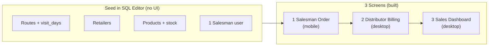
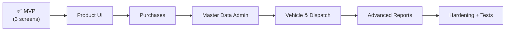
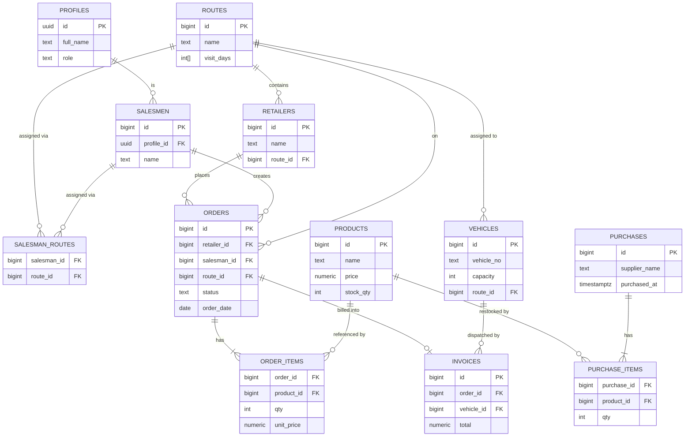
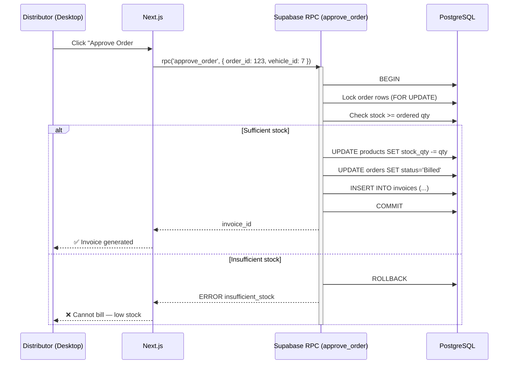
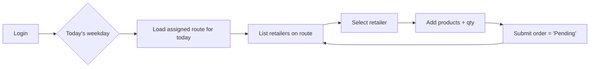
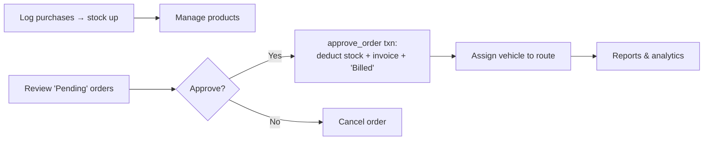

# Distribution Management System (DMS)

A zero-cost, full-stack **Sales & Distribution Management** web application for a distributor and their field salesmen.

> **Stack at a glance:** Next.js + Tailwind CSS (Vercel) · Supabase (PostgreSQL, Auth, Auto-generated REST/Realtime API) · 100% free tier.

---

## Table of Contents

1. [Project Overview](#1-project-overview)
2. [MVP-First Plan (Start Here)](#2-mvp-first-plan-start-here)
3. [Roadmap (Remaining Modules)](#3-roadmap-remaining-modules)
4. [Constraints & Stack](#4-constraints--stack)
5. [Architecture Design](#5-architecture-design)
6. [Core Business Logic & Data Models](#6-core-business-logic--data-models)
7. [End-to-End Workflows](#7-end-to-end-workflows)
8. [Step-by-Step Build Plan (Full)](#8-step-by-step-build-plan-full)
9. [Database Schema (SQL)](#9-database-schema-sql)
10. [Engineering Decisions (Recruiter Talking Points)](#10-engineering-decisions-recruiter-talking-points)

---

## 1. Project Overview

The platform digitizes the daily operations of a goods **distributor**:

- **Field salesmen** (mobile view) visit retailers along a daily route and capture orders.
- The **distributor** (desktop view) manages products, stock purchases, billing, dispatch, fleet, and analytics.

The system is **route-driven**: the day of the week determines which retailers a salesman sees, and a vehicle is assigned to a route for delivery.

> **Build strategy:** Ship a **3-screen MVP first** (Section 2) to get a working, demo-able product fast. The remaining 6 modules are tracked as a **Roadmap** (Section 3). The full schema (Section 9) already supports everything, so the roadmap items are UI-only additions.

---

## 2. MVP-First Plan (Start Here)

The goal: a **working, demo-able product** that showcases the highest-value engineering skills (auth, role-based access, an atomic SQL transaction, real data modeling) in the **least time**.

**Estimated effort:** ~25–35 focused hours · ~2–3 weeks part-time (junior level).

### The 3 Screens

| # | Screen | View | What it does | Skill it showcases |
| --- | --- | --- | --- | --- |
| 1 | **Salesman Order** | Mobile | Login → see today's route → pick retailer → add products → submit `Pending` order | Auth, day-aware querying, RLS, transactional insert |
| 2 | **Distributor Billing** | Desktop | Review `Pending` orders → **Approve** → atomic billing (deduct stock, create invoice, set `Billed`) | `SELECT ... FOR UPDATE` transaction, concurrency safety |
| 3 | **Sales Dashboard** | Desktop | Daily sales + top products charts | SQL aggregate views, data viz |

### MVP Scope (what's IN)

- **Modules included:** Route (1), Retailer (2), Salesman (3), Salesman Workflow (4), Product (6 — read-only is fine), Billing (7 — without vehicle), Report (9 — 2 charts).
- Seed master data (routes, retailers, products, one salesman) **manually via Supabase SQL Editor** — no admin UI yet. This saves the most time.

### MVP Flow



### MVP Build Order (with time estimates)

| Step | Task | Focused hrs |
| --- | --- | --- |
| 1 | Setup: GitHub + Supabase + Vercel + Next.js scaffold | 3–4 |
| 2 | Run schema (Section 9) + seed master data via SQL | 2–3 |
| 3 | Auth + role-based redirect (salesman → mobile, distributor → desktop) | 5–7 |
| 4 | **Screen 1** — Salesman order capture | 7–9 |
| 5 | **Screen 2** — Distributor pending queue + `approve_order()` RPC | 5–7 |
| 6 | **Screen 3** — Dashboard (2 charts from views) | 3–5 |
| 7 | Responsive polish + deploy to Vercel | 3–4 |
| | **MVP total** | **~28–39 hrs** |

### Definition of Done (MVP)

- [ ] A salesman logs in on a phone and submits an order for today's route.
- [ ] A distributor approves it; stock drops and an invoice is created **atomically**.
- [ ] The dashboard shows today's sales and top products.
- [ ] Deployed live on Vercel with a shareable URL.

---

## 3. Roadmap (Remaining Modules)

These build on the **same schema** — they're primarily **UI/admin additions**, so each reuses patterns from the MVP. Track them as *in progress* on your portfolio to show scope awareness.

| Status | Module | Adds | Est. hrs | Reuses |
| --- | --- | --- | --- | --- |
| 🔜 Planned | **Product Management UI** (6) | CRUD for products/prices/stock instead of SQL seeding | 5–7 | CRUD pattern |
| 🔜 Planned | **Purchase Segment** (5) | Log inbound stock; `apply_purchase_stock()` increments qty | 6–8 | Order-items pattern |
| 🔜 Planned | **Master Data Admin** (1, 2, 3) | UI for Routes, Retailers, Salesman assignments | 8–10 | CRUD + M:N linking |
| 🔜 Planned | **Vehicle & Dispatch** (8) | Fleet CRUD + assign vehicle to route during billing | 6–8 | CRUD + billing hook |
| 🔜 Planned | **Advanced Reports** (9) | Route-wise revenue, date filters, CSV export | 5–7 | Dashboard pattern |
| 🔜 Planned | **Hardening** | Tighter RLS, input validation, optimistic UI, tests | 8–12 | — |

**Roadmap total:** ~38–52 focused hrs (brings the full 9-module build to the ~80–115 hr range from the original estimate).

### Suggested order



> **Portfolio tip:** A shipped 3-screen MVP + a clear roadmap reads better to recruiters than a half-finished 9-module app. It demonstrates **prioritization** and **scoping** — exactly what teams want from a junior engineer.

---

## 4. Constraints & Stack

| Concern | Decision | Why |
| --- | --- | --- |
| **Cost** | 100% free tier (Vercel + Supabase) | No infra spend; ideal for MVP / portfolio |
| **Frontend** | Next.js (App Router) + Tailwind CSS | SSR/ISR, file-based routing, fast styling |
| **Hosting (FE)** | Vercel | Free, Git-based CI/CD, edge network |
| **Backend** | Supabase (no custom server) | Auth + Postgres + auto REST/Realtime API |
| **Database** | PostgreSQL (via Supabase) | ACID transactions, RLS, RPC functions |
| **Auth** | Supabase Auth (email/password + roles) | Built-in, JWT-based, integrates with RLS |
| **Architecture** | Responsive SPA/SSR | Desktop = distributor, Mobile = salesman |

---

## 5. Architecture Design

### 5.1 High-Level Architecture

```mermaid
flowchart TB
    subgraph Clients["Client Layer (Responsive Web App)"]
        Mobile["📱 Salesman View<br/>(Mobile-responsive)<br/>Order capture"]
        Desktop["🖥️ Distributor View<br/>(Desktop)<br/>Billing, Stock, Reports"]
    end

    subgraph Vercel["Vercel (Free Hosting)"]
        Next["Next.js App<br/>App Router + Tailwind CSS<br/>Server & Client Components"]
    end

    subgraph Supabase["Supabase (Free Backend)"]
        Auth["🔐 Supabase Auth<br/>JWT + Roles"]
        API["⚙️ Auto REST / Realtime API<br/>(PostgREST)"]
        RPC["🧮 RPC Functions<br/>(Atomic billing txn)"]
        DB[("🐘 PostgreSQL<br/>Tables + RLS Policies")]
        Storage["🗂️ Storage<br/>(optional: invoices)"]
    end

    Mobile -->|HTTPS| Next
    Desktop -->|HTTPS| Next
    Next -->|supabase-js SDK| Auth
    Next -->|supabase-js SDK| API
    Next -->|rpc()| RPC
    Auth --> DB
    API --> DB
    RPC --> DB
    DB -. enforces .-> RLS["Row Level Security"]
```

### 5.2 Data Model (ER Diagram)



### 5.3 Billing Transaction Sequence



---

## 6. Core Business Logic & Data Models

| # | Segment | Responsibility | Primary Tables |
| --- | --- | --- | --- |
| 1 | **Route** | Name + days of week visited | `routes` |
| 2 | **Retailer Master** | Shops mapped to a route | `retailers` |
| 3 | **Salesman** | Users assigned to routes | `salesmen`, `salesman_routes` |
| 4 | **Salesman Workflow** | Day-aware order capture (mobile) | `orders`, `order_items` |
| 5 | **Purchase** | Log inbound stock, increase qty | `purchases`, `purchase_items` |
| 6 | **Product** | Items, prices, stock levels | `products` |
| 7 | **Billing & Dispatch** | Approve → invoice → deduct stock | `invoices` + `approve_order()` |
| 8 | **Vehicle** | Fleet + route assignment | `vehicles` |
| 9 | **Report** | Daily sales, route revenue, top products | views / aggregate queries |

**Order status lifecycle:** `Pending` → `Billed` → (`Dispatched`/`Delivered` optional) or `Cancelled`.

---

## 7. End-to-End Workflows

### 7.1 Salesman (Mobile)



### 7.2 Distributor (Desktop)



---

## 8. Step-by-Step Build Plan (Full)

> This is the **complete 9-module** plan. For the fastest route to a demo, follow [Section 2 (MVP-First)](#2-mvp-first-plan-start-here) instead, then return here for the roadmap modules.
>
> Build from the **database up** so the API contract is stable before UI work.

### Phase 0 — Tooling & Accounts (Free)
1. Create a **GitHub** repo.
2. Create a **Supabase** project (free tier) → note `Project URL` + `anon key`.
3. Create a **Vercel** account, link it to the GitHub repo.

### Phase 1 — Database
4. Open Supabase **SQL Editor** → run the [schema script](#9-database-schema-sql).
5. Seed reference data (routes, products, a test salesman).
6. Enable **Row Level Security (RLS)** and add policies.
7. Create the `approve_order()` **RPC** for atomic billing.

### Phase 2 — Project Scaffold
8. `npx create-next-app@latest dms --ts --tailwind --app`
9. Install SDK: `npm i @supabase/supabase-js @supabase/ssr`
10. Add env vars: `NEXT_PUBLIC_SUPABASE_URL`, `NEXT_PUBLIC_SUPABASE_ANON_KEY`.
11. Create a Supabase client helper (`lib/supabase/`).

### Phase 3 — Auth & Roles
12. Build login page (Supabase Auth, email/password).
13. Store `role` (`distributor` | `salesman`) in `profiles`.
14. Add middleware to redirect by role (mobile salesman vs desktop distributor).

### Phase 4 — Salesman Mobile Flow
15. Resolve today's weekday → fetch assigned route → list retailers.
16. Order builder UI (product picker, qty, running total).
17. Submit order as `Pending` (insert `orders` + `order_items`).

### Phase 5 — Distributor Desktop Flow
18. Products CRUD + stock view.
19. Purchases screen (insert `purchases`/`purchase_items`, increment stock).
20. Pending-orders queue → **Approve** calls `approve_order()` RPC.
21. Vehicle management + route assignment.

### Phase 6 — Reports
22. SQL aggregate views; render charts (e.g., Recharts).
23. Daily sales, route-wise revenue, top-selling products.

### Phase 7 — Ship
24. Push to GitHub → Vercel auto-deploys.
25. Set Vercel env vars; smoke-test on mobile + desktop.

---

## 9. Database Schema (SQL)

Run this in the **Supabase SQL Editor**. It creates all tables, relationships, constraints, the atomic billing function, and baseline RLS.

```sql
-- =====================================================================
-- DISTRIBUTION MANAGEMENT SYSTEM — SCHEMA
-- Target: Supabase / PostgreSQL
-- =====================================================================

-- Clean enums (idempotent-ish for re-runs in dev)
do $$
begin
  if not exists (select 1 from pg_type where typname = 'user_role') then
    create type user_role as enum ('distributor', 'salesman');
  end if;
  if not exists (select 1 from pg_type where typname = 'order_status') then
    create type order_status as enum ('Pending', 'Billed', 'Dispatched', 'Delivered', 'Cancelled');
  end if;
end$$;

-- ---------------------------------------------------------------------
-- 1. PROFILES  (1:1 with auth.users; holds role)
-- ---------------------------------------------------------------------
create table if not exists profiles (
  id          uuid primary key references auth.users (id) on delete cascade,
  full_name   text not null,
  role        user_role not null default 'salesman',
  created_at  timestamptz not null default now()
);

-- ---------------------------------------------------------------------
-- 2. ROUTES  (visit_days: ISO weekday numbers 1=Mon ... 7=Sun)
-- ---------------------------------------------------------------------
create table if not exists routes (
  id          bigint generated always as identity primary key,
  name        text not null unique,
  visit_days  smallint[] not null default '{}',   -- e.g. {1,4} = Mon & Thu
  created_at  timestamptz not null default now(),
  -- guard: every element must be a valid ISO weekday
  constraint visit_days_valid
    check (visit_days <@ array[1,2,3,4,5,6,7]::smallint[])
);

-- ---------------------------------------------------------------------
-- 3. RETAILERS  (shops mapped to a route)
-- ---------------------------------------------------------------------
create table if not exists retailers (
  id          bigint generated always as identity primary key,
  name        text not null,
  phone       text,
  address     text,
  route_id    bigint not null references routes (id) on delete restrict,
  created_at  timestamptz not null default now()
);
create index if not exists idx_retailers_route on retailers (route_id);

-- ---------------------------------------------------------------------
-- 4. SALESMEN  (links a profile/user to salesman metadata)
-- ---------------------------------------------------------------------
create table if not exists salesmen (
  id          bigint generated always as identity primary key,
  profile_id  uuid not null unique references profiles (id) on delete cascade,
  name        text not null,
  phone       text,
  active      boolean not null default true,
  created_at  timestamptz not null default now()
);

-- ---------------------------------------------------------------------
-- 5. SALESMAN_ROUTES  (M:N — a salesman can cover multiple routes)
-- ---------------------------------------------------------------------
create table if not exists salesman_routes (
  salesman_id bigint not null references salesmen (id) on delete cascade,
  route_id    bigint not null references routes (id)   on delete cascade,
  primary key (salesman_id, route_id)
);

-- ---------------------------------------------------------------------
-- 6. PRODUCTS  (master list, price, live stock)
-- ---------------------------------------------------------------------
create table if not exists products (
  id          bigint generated always as identity primary key,
  sku         text unique,
  name        text not null,
  price       numeric(12,2) not null check (price >= 0),
  stock_qty   integer not null default 0 check (stock_qty >= 0),
  created_at  timestamptz not null default now()
);

-- ---------------------------------------------------------------------
-- 7. PURCHASES  (inbound stock header)
-- ---------------------------------------------------------------------
create table if not exists purchases (
  id            bigint generated always as identity primary key,
  supplier_name text not null,
  note          text,
  purchased_at  timestamptz not null default now(),
  created_by    uuid references profiles (id)
);

create table if not exists purchase_items (
  id          bigint generated always as identity primary key,
  purchase_id bigint not null references purchases (id) on delete cascade,
  product_id  bigint not null references products (id)  on delete restrict,
  qty         integer not null check (qty > 0),
  unit_cost   numeric(12,2) not null default 0 check (unit_cost >= 0)
);
create index if not exists idx_purchase_items_purchase on purchase_items (purchase_id);

-- ---------------------------------------------------------------------
-- 8. VEHICLES  (fleet + route assignment)
-- ---------------------------------------------------------------------
create table if not exists vehicles (
  id          bigint generated always as identity primary key,
  vehicle_no  text not null unique,
  capacity    integer check (capacity > 0),
  route_id    bigint references routes (id) on delete set null,
  created_at  timestamptz not null default now()
);

-- ---------------------------------------------------------------------
-- 9. ORDERS  (header) + ORDER_ITEMS (lines)
-- ---------------------------------------------------------------------
create table if not exists orders (
  id          bigint generated always as identity primary key,
  retailer_id bigint not null references retailers (id) on delete restrict,
  salesman_id bigint not null references salesmen (id)  on delete restrict,
  route_id    bigint not null references routes (id)    on delete restrict,
  status      order_status not null default 'Pending',
  order_date  date not null default current_date,
  created_at  timestamptz not null default now()
);
create index if not exists idx_orders_status on orders (status);
create index if not exists idx_orders_route_date on orders (route_id, order_date);

create table if not exists order_items (
  id          bigint generated always as identity primary key,
  order_id    bigint not null references orders (id)   on delete cascade,
  product_id  bigint not null references products (id) on delete restrict,
  qty         integer not null check (qty > 0),
  unit_price  numeric(12,2) not null check (unit_price >= 0)
);
create index if not exists idx_order_items_order on order_items (order_id);

-- ---------------------------------------------------------------------
-- 10. INVOICES  (created on billing; one per order)
-- ---------------------------------------------------------------------
create table if not exists invoices (
  id          bigint generated always as identity primary key,
  order_id    bigint not null unique references orders (id) on delete restrict,
  vehicle_id  bigint references vehicles (id) on delete set null,
  total       numeric(14,2) not null check (total >= 0),
  billed_at   timestamptz not null default now()
);

-- =====================================================================
-- ATOMIC BILLING FUNCTION
-- Deduct stock + flip status + create invoice in ONE transaction.
-- SECURITY DEFINER so it runs with owner rights under RLS.
-- =====================================================================
create or replace function approve_order(p_order_id bigint, p_vehicle_id bigint default null)
returns bigint
language plpgsql
security definer
set search_path = public
as $$
declare
  v_status   order_status;
  v_total    numeric(14,2);
  v_invoice  bigint;
  r          record;
begin
  -- Lock the order to prevent double-billing
  select status into v_status
  from orders
  where id = p_order_id
  for update;

  if v_status is null then
    raise exception 'Order % not found', p_order_id;
  end if;

  if v_status <> 'Pending' then
    raise exception 'Order % is not Pending (current: %)', p_order_id, v_status;
  end if;

  -- Validate + deduct stock per line (lock product rows)
  for r in
    select oi.product_id, oi.qty, oi.unit_price
    from order_items oi
    where oi.order_id = p_order_id
  loop
    update products
       set stock_qty = stock_qty - r.qty
     where id = r.product_id
       and stock_qty >= r.qty;

    if not found then
      raise exception 'Insufficient stock for product %', r.product_id;
    end if;
  end loop;

  -- Compute invoice total
  select coalesce(sum(qty * unit_price), 0)
    into v_total
  from order_items
  where order_id = p_order_id;

  -- Flip status + create invoice
  update orders set status = 'Billed' where id = p_order_id;

  insert into invoices (order_id, vehicle_id, total)
  values (p_order_id, p_vehicle_id, v_total)
  returning id into v_invoice;

  return v_invoice;
end;
$$;

-- =====================================================================
-- HELPER: increment product stock on purchase (call after inserting items)
-- =====================================================================
create or replace function apply_purchase_stock(p_purchase_id bigint)
returns void
language plpgsql
security definer
set search_path = public
as $$
begin
  update products p
     set stock_qty = p.stock_qty + pi.qty
  from purchase_items pi
  where pi.purchase_id = p_purchase_id
    and pi.product_id = p.id;
end;
$$;

-- =====================================================================
-- REPORTING VIEWS
-- =====================================================================
create or replace view v_daily_sales as
select o.order_date,
       count(distinct i.id)            as invoices,
       sum(i.total)                    as revenue
from invoices i
join orders o on o.id = i.order_id
group by o.order_date
order by o.order_date desc;

create or replace view v_route_revenue as
select r.id as route_id, r.name as route_name,
       sum(i.total) as revenue
from invoices i
join orders o on o.id = i.order_id
join routes r on r.id = o.route_id
group by r.id, r.name
order by revenue desc;

create or replace view v_top_products as
select p.id, p.name,
       sum(oi.qty)               as units_sold,
       sum(oi.qty * oi.unit_price) as revenue
from order_items oi
join orders o   on o.id = oi.order_id and o.status <> 'Cancelled'
join products p on p.id = oi.product_id
group by p.id, p.name
order by units_sold desc;

-- =====================================================================
-- ROW LEVEL SECURITY (baseline — tighten per your needs)
-- =====================================================================
alter table profiles        enable row level security;
alter table routes          enable row level security;
alter table retailers       enable row level security;
alter table salesmen        enable row level security;
alter table salesman_routes enable row level security;
alter table products        enable row level security;
alter table purchases       enable row level security;
alter table purchase_items  enable row level security;
alter table vehicles        enable row level security;
alter table orders          enable row level security;
alter table order_items     enable row level security;
alter table invoices        enable row level security;

-- Convenience: is the current user a distributor?
create or replace function is_distributor()
returns boolean
language sql stable
security definer
set search_path = public
as $$
  select exists (
    select 1 from profiles
    where id = auth.uid() and role = 'distributor'
  );
$$;

-- Everyone authenticated can read master/reference data
create policy read_routes      on routes      for select to authenticated using (true);
create policy read_retailers   on retailers   for select to authenticated using (true);
create policy read_products    on products    for select to authenticated using (true);
create policy read_vehicles    on vehicles    for select to authenticated using (true);

-- Profiles: a user sees their own; distributor sees all
create policy read_own_profile on profiles for select to authenticated
  using (id = auth.uid() or is_distributor());

-- Distributor-only writes on master data
create policy write_routes    on routes    for all to authenticated
  using (is_distributor()) with check (is_distributor());
create policy write_retailers on retailers for all to authenticated
  using (is_distributor()) with check (is_distributor());
create policy write_products  on products  for all to authenticated
  using (is_distributor()) with check (is_distributor());
create policy write_vehicles  on vehicles  for all to authenticated
  using (is_distributor()) with check (is_distributor());
create policy write_purchases on purchases for all to authenticated
  using (is_distributor()) with check (is_distributor());

-- Salesman: can read their own orders; distributor reads all
create policy read_orders on orders for select to authenticated
  using (
    is_distributor()
    or salesman_id in (
      select s.id from salesmen s where s.profile_id = auth.uid()
    )
  );

-- Salesman: can create orders for routes they own
create policy create_orders on orders for insert to authenticated
  with check (
    salesman_id in (select s.id from salesmen s where s.profile_id = auth.uid())
  );

-- Distributor: can update/bill orders
create policy update_orders on orders for update to authenticated
  using (is_distributor()) with check (is_distributor());

-- =====================================================================
-- (Optional) SEED DATA — comment out in production
-- =====================================================================
-- insert into routes (name, visit_days) values
--   ('Route A', '{1}'),       -- Mondays
--   ('Route B', '{2,5}');     -- Tue & Fri
-- insert into products (sku, name, price, stock_qty) values
--   ('SKU-001', 'Soap 100g', 25.00, 500),
--   ('SKU-002', 'Shampoo 200ml', 80.00, 200);
```

### 9.1 Querying today's route (salesman view)

```sql
-- ISO weekday: extract(isodow from current_date) → 1=Mon ... 7=Sun
select r.*
from retailers r
join salesman_routes sr on sr.route_id = r.route_id
join salesmen s         on s.id = sr.salesman_id
where s.profile_id = auth.uid()
  and extract(isodow from current_date)::smallint = any (
      select unnest(visit_days) from routes where id = r.route_id
  );
```

### 9.2 Approving an order (from the app)

```js
// Supabase JS — atomic billing via RPC
const { data: invoiceId, error } = await supabase.rpc('approve_order', {
  p_order_id: 123,
  p_vehicle_id: 7,
});
if (error) throw error; // e.g. "Insufficient stock for product 5"
```

---

## 10. Engineering Decisions (Recruiter Talking Points)

- **Why an RPC for billing instead of multiple client calls?**
  Stock deduction, status change, and invoice creation must be **atomic**. Doing them as separate client requests risks partial failure (stock deducted but no invoice). A single `plpgsql` function wraps them in one transaction with `SELECT ... FOR UPDATE` row locks to prevent **double-billing** and **overselling** under concurrency.

- **Why `visit_days` as a `smallint[]` with ISO weekdays?**
  A route maps to recurring weekdays. Storing ISO weekday numbers (`1=Mon`) lets the salesman query use `extract(isodow ...)` directly — no string parsing, index-friendly, and validated by a `CHECK` constraint.

- **Why separate `profiles` from `auth.users`?**
  Supabase owns `auth.users`. A `profiles` table (1:1, FK to `auth.users.id`) is the supported pattern to attach app data like **role**, which then powers **RLS** policies.

- **Why Row Level Security?**
  Because there's **no custom backend**, the database itself is the security boundary. RLS guarantees a salesman can only read/insert **their own** orders, while distributors get full access — enforced even if the client is compromised.

- **Why `on delete restrict` on financial links?**
  Orders, invoices, and stock movements are records of truth. Restricting deletes prevents silently breaking historical/financial integrity; use status flags (e.g., `Cancelled`) instead of hard deletes.

- **Why views for reports?**
  Aggregations (`v_daily_sales`, `v_route_revenue`, `v_top_products`) live in SQL so the frontend just selects from a view — keeps business math in one place and testable.

- **Why Next.js + Supabase on free tiers?**
  Zero server to maintain: Vercel serves the UI, Supabase provides Auth + Postgres + auto API. This minimizes ops and cost while remaining production-grade and horizontally scalable.

---

### Acknowledgement

Constraints understood: **100% free** (Vercel + Supabase), **Next.js + Tailwind** frontend, **Supabase/PostgreSQL** backend with **no separate server**, responsive **desktop (distributor)** + **mobile (salesman)** views, and **atomic transactions** for billing. The SQL above is the complete schema to start. Next recommended step: scaffold the Next.js app and wire Supabase Auth.
